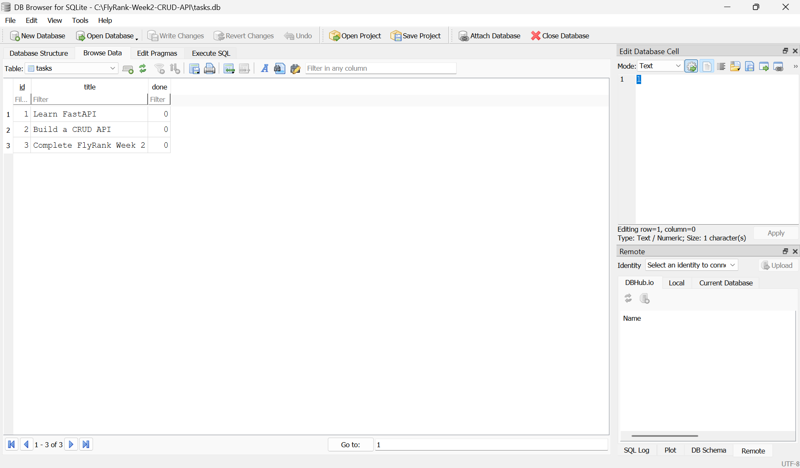

# FlyRank Week 2 — CRUD API with SQLite

A Task CRUD API built with **FastAPI** and **SQLite**.

## Project Overview

This project started as an in-memory CRUD API and was updated to use a real SQLite database for persistent storage.

The API keeps the same CRUD endpoints while storing tasks permanently in `tasks.db`.

### Architecture

```text
Client → FastAPI API → SQLite Database
```

## Why SQLite?

SQLite was chosen because it is lightweight, simple to set up, and does not require a separate database server.

The database is stored as a single file, making it suitable for this assignment and easy to run locally.

## Database

The SQLite database file is:

```text
tasks.db
```

It is stored in the root directory of the project:

```text
FlyRank-Week2-CRUD-API/
├── main.py
├── tasks.db
├── database.png
├── swagger.png
└── README.md
```

The application automatically creates the database and `tasks` table if they do not already exist.

Three example tasks are inserted only when the table is empty.

## How to Start the Project

### 1. Clone the repository

```bash
git clone https://github.com/snehatiwari001/FlyRank-Week2-CRUD-API.git
cd FlyRank-Week2-CRUD-API
```

### 2. Activate the virtual environment

Windows PowerShell:

```powershell
.\venv\Scripts\Activate.ps1
```

### 3. Start the FastAPI server

```powershell
uvicorn main:app --reload
```

The API will run at:

```text
http://127.0.0.1:8000
```

Swagger API documentation is available at:

```text
http://127.0.0.1:8000/docs
```

## API Endpoints

| Method | Endpoint           | Description      |
| ------ | ------------------ | ---------------- |
| GET    | `/`                | API information  |
| GET    | `/health`          | Health check     |
| GET    | `/tasks`           | Get all tasks    |
| GET    | `/tasks/{task_id}` | Get a task by ID |
| POST   | `/tasks`           | Create a task    |
| PUT    | `/tasks/{task_id}` | Update a task    |
| DELETE | `/tasks/{task_id}` | Delete a task    |

## SQLite SQL Queries

The following SQL queries were executed manually using DB Browser for SQLite.

### List all tasks

```sql
SELECT * FROM tasks;
```

### Show completed tasks

```sql
SELECT * FROM tasks WHERE done = 1;
```

### Count tasks

```sql
SELECT COUNT(*) FROM tasks;
```

### Mark all tasks as completed

```sql
UPDATE tasks SET done = 1;
```

### Delete completed tasks

```sql
DELETE FROM tasks WHERE done = 1;
```

## Database Screenshot

The database was opened using DB Browser for SQLite.



## Features

* FastAPI CRUD API
* SQLite persistent storage
* Automatic database creation
* Automatic table creation
* Example data inserted on first run
* 400 validation errors for invalid titles
* 404 errors for unknown task IDs
* Data persists across server restarts

## Assignment Stages

* ✅ Stage 0 — Create SQLite database
* ✅ Stage 1 — Database read endpoints
* ✅ Stage 2 — Insert into database
* ✅ Stage 3 — Update and delete with SQL
* ✅ Stage 4 — Explore SQLite
* ✅ Stage 5 — Database documentation
